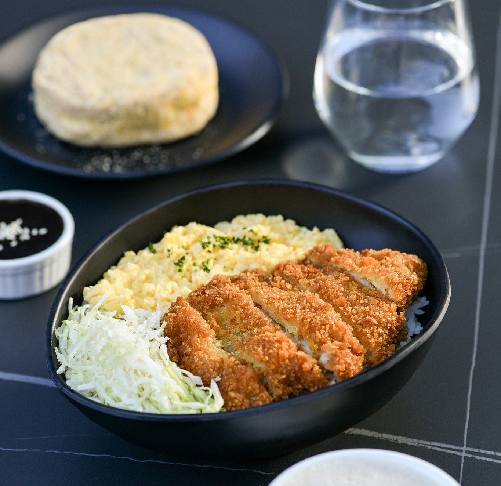
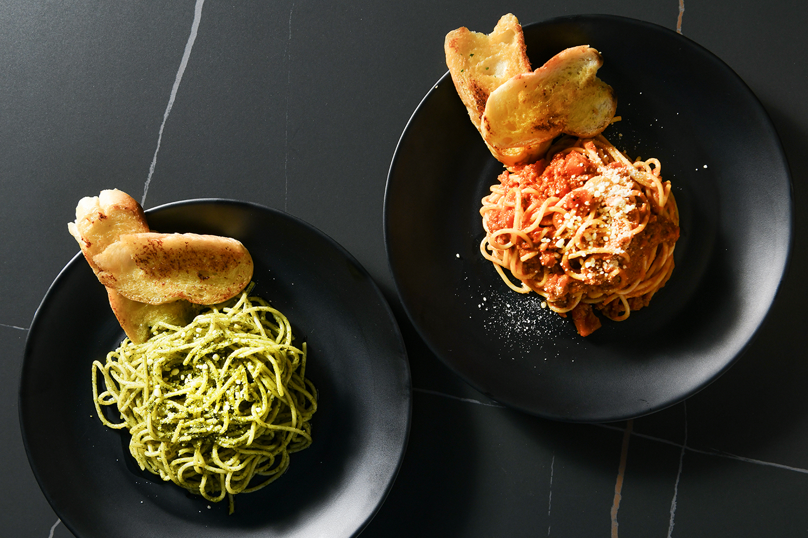
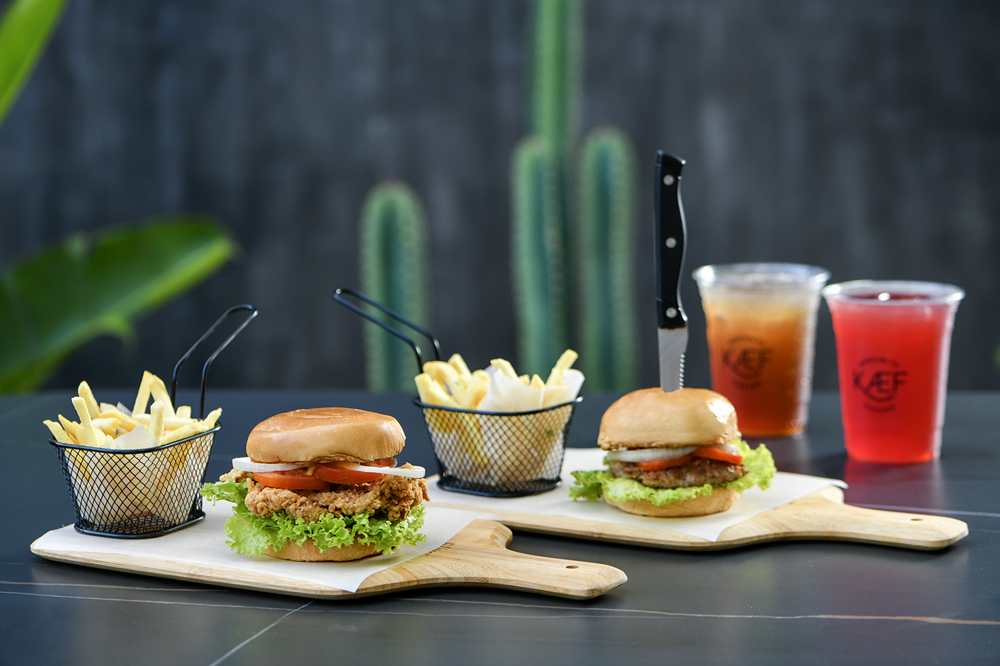

# Cozy-Cup-Cafe
# Cozy Cup Cafe Readme

## Project Description
Welcome to Cozy Cup Cafe, where every cup tells a story and every bite brings comfort. Nestled in the heart of the city, Cozy Cup Cafe offers a haven for coffee enthusiasts and food lovers alike. Our aim is to provide a warm and inviting atmosphere where patrons can relax, unwind, and indulge in a variety of delicious treats.

## Features
- Signature Coffee Blends: Explore a diverse selection of artisanal coffee blends sourced from around the world. From bold and robust to smooth and creamy, there's a perfect cup for every palate.

- Gourmet Food Menu: Indulge in culinary delights crafted with passion and expertise. Our menu features an array of mouthwatering dishes, from savory sandwiches and hearty salads to decadent desserts and pastries.

- Cozy Ambiance: Immerse yourself in the inviting ambiance of our cafe, complete with comfortable seating, soft lighting, and rustic decor. Whether you're catching up with friends or enjoying a quiet moment alone, Cozy Cup Cafe provides the perfect setting.

- Friendly Service: Experience exceptional hospitality from our dedicated team of baristas and staff. We're committed to providing attentive service with a smile, ensuring that every visit is a memorable one.

- Community Events: Join us for a variety of community events, including live music performances, open mic nights, and art exhibitions. Cozy Cup Cafe is more than just a coffee shop - it's a hub for creativity, connection, and culture.

- Takeaway and Delivery: Can't stay? No problem! Take the taste of Cozy Cup Cafe wherever you go with our convenient takeaway options. Plus, enjoy the same quality and flavor from the comfort of your own home with our delivery service.

## Screen Captures

*Savor the crispy indulgence of Pork Tonkatsu, a succulent deep-fried breaded pork cutlet, boasting a golden-brown exterior that encases tender meat within.*

*Experience a delightful culinary contrast with the vibrant freshness of green pasta, infused with spinach or herbs, and the classic richness of tomato pasta, featuring a robust tomato-based sauce, offering a symphony of flavors on your plate.*

*Indulge in a classic combination of savory satisfaction with a juicy burger paired perfectly with crispy fries, complemented by the refreshing sweetness of a chilled red iced tea.*

*Matcha hot coffee combines the earthy richness of matcha with the comforting warmth of traditional coffee, creating a uniquely flavorful and invigorating beverage.*

## About the Authors

**Name:** [Queanna Brittany Ibrahim]

**Email:** [202080061@psu.palawan.edu.ph]

